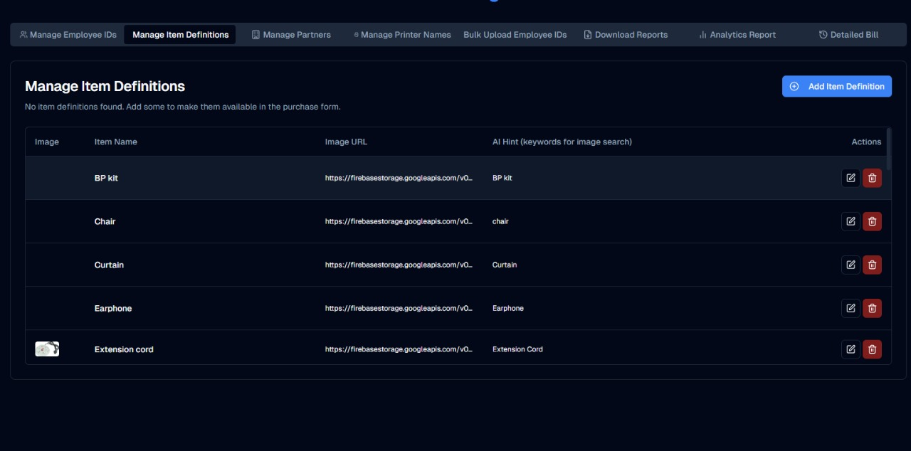
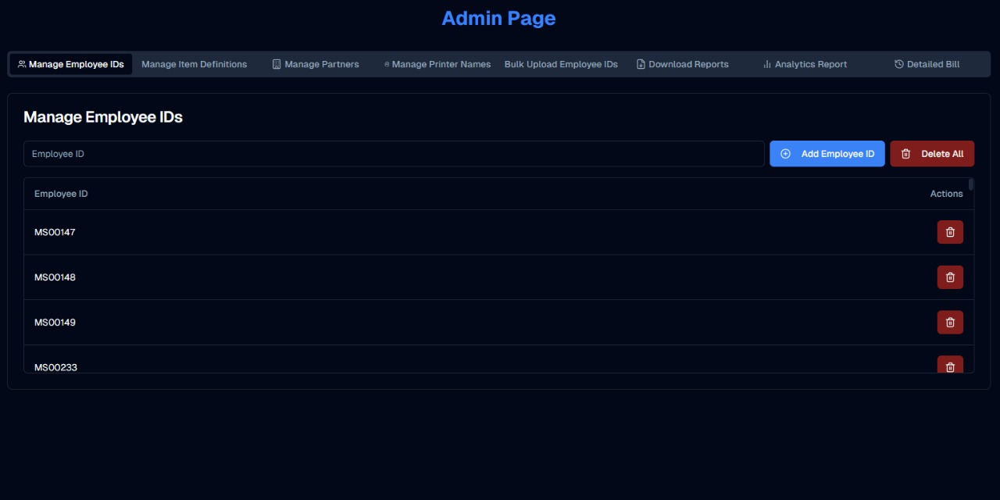

<div align="center">
  
</div>

<div align="center">
  
</div>

<div align="center">
  
  
  
  
</div>

<br />

A modern **furniture e-commerce storefront** built with Next.js (App Router) — product browsing, detail pages, and a clean shopping flow. Bootstrapped in Firebase Studio.

## ✨ Features

- 🪑 Furniture catalog with category browsing
- 📄 Rich product detail pages
- 🛒 Cart flow, mobile-responsive
- ⚡ Next.js App Router + TypeScript for speed + type safety

## 🚀 Run it locally

```bash
cd "Furniture App (React)"
npm install
npm run dev          # http://localhost:3000

# production
npm run build && npm start
```

Entry point: `src/app/page.tsx`. Drop in your own product data + Firebase config to make it live.

## 🖼 Screenshots

<div align="center">
  
  
</div>

<br />

<div align="center">
  <a href="https://github.com/SatvickMalhotra/full-stack-apps-with-AI"></a>
  <a href="https://github.com/SatvickMalhotra"></a>
</div>


