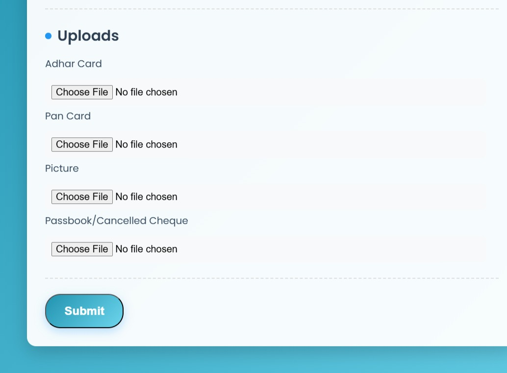
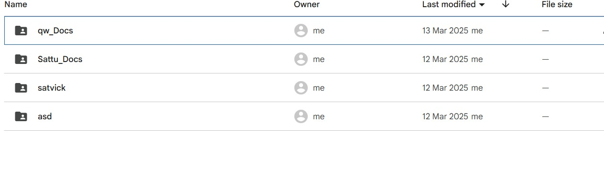

<div align="center">
  
</div>

<div align="center">
  
</div>

<div align="center">
  
  
  
  
</div>

<br />

An HR system that streamlines capturing and managing employee information — a clean web form that auto-stores everything into **Google Sheets** and uploads documents to **Google Drive**. Zero backend infrastructure.

## ✨ Features

- 📋 **Captures** basic details, contact + work, bank details, addresses, personal info
- 🗂 **Auto-storage** — submissions land in Google Sheets instantly
- 📎 **Document uploads** — resumes / ID proofs go straight to Drive, organized
- 🖥 **Clean UI** — HTML/CSS form, JS interactivity

## 🧱 Tech Stack

Google Apps Script · Google Sheets API · Google Drive API · HTML/CSS/JS

## 🚀 Deploy it

```text
1. Open script.google.com → New project
2. Paste code.gs  +  add index.html as an HTML file
3. Update the target Sheet ID + Drive folder ID in code.gs
4. Deploy → New deployment → type "Web app"
5. Execute as: Me  ·  Who has access: Anyone (or your org)
6. Share the generated /exec URL — that's your live HR form
```

## 🖼 Screenshots

<div align="center">
  
  
</div>

<br />

<div align="center">
  <a href="https://github.com/SatvickMalhotra/full-stack-apps-with-AI"></a>
  <a href="https://github.com/SatvickMalhotra"></a>
</div>


