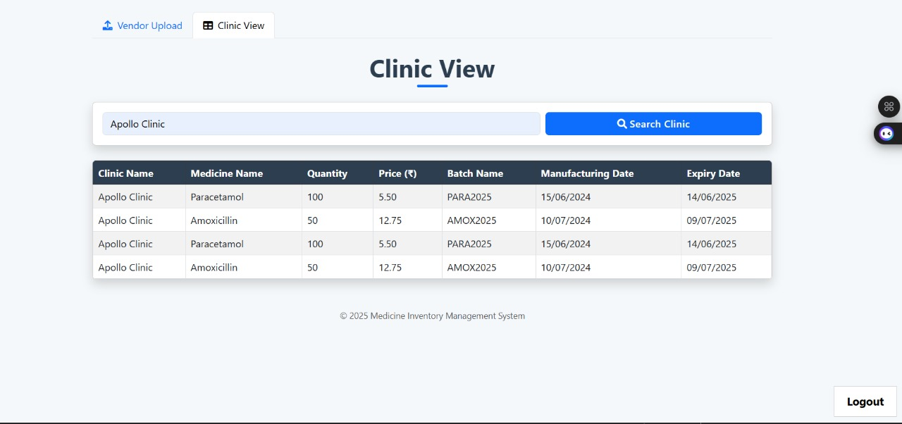
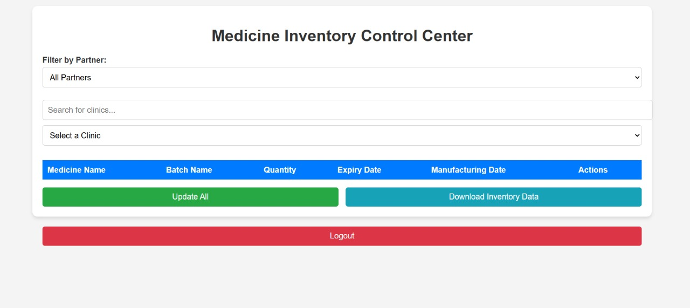

<div align="center">
  
</div>

<div align="center">
  
</div>

<div align="center">
  
  
  
  
</div>

<br />

A comprehensive **medication-database & inventory system**. Different roles interact with the inventory, place orders, and maintain accurate records.

## ✨ Features by file

| File | Who | What |
|---|---|---|
| `index.html` | Everyone | Login → routes users/partners to their page by ID |
| `Modify.html` | Pharmacist | Medicine inventory management ("Medicine Portal") |
| Vendor files | Vendor | Place clinic orders + approve meds for dispatch (admin can approve too) |
| `invmanage.html` | Partners | Bulk-download data for any partner / clinic |

## 🧱 Tech Stack

HTML · CSS · JavaScript · Firebase (inventory data) — zero build step

## 🚀 Run it locally

```bash
cd "MediTrack System"

# Add Firebase config, then open the login page:
start index.html        # Windows
open index.html         # macOS
```

> Use VS Code **Live Server** so Firebase auth + reads work cleanly over http.

## 🖼 Screenshots

<div align="center">
  
  
</div>

<br />

<div align="center">
  <a href="https://github.com/SatvickMalhotra/full-stack-apps-with-AI"></a>
  <a href="https://github.com/SatvickMalhotra"></a>
</div>


